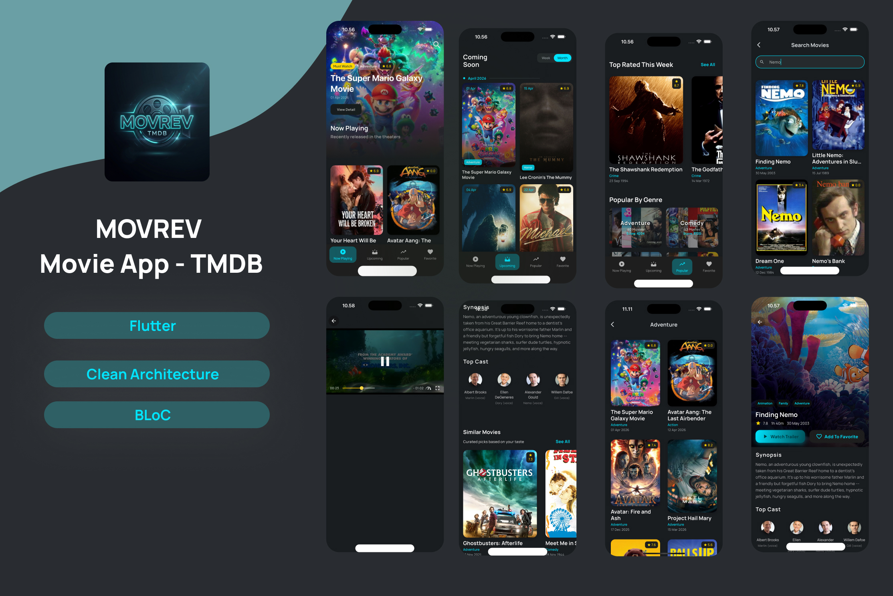

# MOVREV - TMDB API

### 📥 [Download Demo APK (Android)](demo.apk?raw=true)

[](screenshots.jpg)
MOVREV is a Flutter-based mobile application that displays movie information from The Movie Database (TMDb) API. Built with a focus on performance, clean code, and a modern UI/UX design.

This project adopts **Clean Architecture** standards and **Dependency Injection** for maximum maintainability and scalability.

## ✨ Features

- **Now Playing**: Displays a list of movies currently playing in theaters with a dynamic parallax header.
- **Up Coming**: Displays a list of upcoming movie releases.
  - *Filters*: Provides options to filter movies by Week and Month.
- **Popular Movie**: Explore popular movies.
  - *Top Rated*: A list of movies with the highest ratings and reviews from the audience.
  - *By Genre*: A feature to filter popular movies based on their specific genres.
- **Detail Movie**: Displays comprehensive information and an overview (synopsis, ratings, posters, etc.) of a selected movie.
- **Trailer Video**: Plays the official movie video trailer, integrated directly within the application.

## 🏗️ Project Structure (Clean Architecture)

Architecturally, this project strictly separates its codebase into independent layers to apply the *Separation of Concerns* principle.

```text
lib/
│
├── app/              # (Core app initialization, Dependency Injection & App widget)
│   ├── app.dart
│   └── injection.dart
│
├── core/             # (Core utilities, constants, and global configs)
│   ├── config/       # (API Configuration, Base URL)
│   ├── routes/       # (Application routing configuration)
│   ├── theme/        # (Colors, typography, global UI settings)
│   └── utils/        # (Helper functions and formatters)
│
├── data/             # DATA LAYER (Raw data processing)
│   ├── datasource/   # (TMDb Remote API calls / Local data)
│   ├── models/       # (Data Transfer Objects / JSON Models)
│   └── repositories/ # (Implementation of Domain Layer repository contracts)
│
├── domain/           # DOMAIN LAYER (Business logic core, most independent layer)
│   ├── entities/     # (Pure business objects used by the UI)
│   ├── repositories/ # (Communication interface contracts for the data layer)
│   └── usecases/     # (Specific rules per feature functionality)
│
├── presentation/     # PRESENTATION LAYER (User Interface)
│   ├── all/          # (UI & State management for 'All' items generic view)
│   ├── detail/       # (UI & State management for Movie Details)
│   ├── favorite/     # (UI & State management for Favorite Movies)
│   ├── now_playing/  # (UI & State management for Now Playing)
│   ├── popular/      # (UI & State management for Popular Movies)
│   ├── shared/       # (Shared generic UI components across pages)
│   ├── shell/        # (Main navigation shell / bottom navigation bar)
│   └── upcoming/     # (UI & State management for Upcoming Releases)
│
└── main.dart         # Entry point of the application
```

### 💉 Dependency Injection
This project implements **Dependency Injection**. It ensures that the testing process (Mocking) is incredibly straightforward, the code is highly *loosely coupled*, and the lifetime of a class/bloc is more structured and centralized. The registration of these objects is usually handled and centralized in the `/app` directory or during initial setup.

## ⚙️ TMDB API Configuration (Important)

To run this application with real movie data, it is mandatory to have an API Key from [TMDb](https://www.themoviedb.org/).

1. Create a free account at [TMDb](https://www.themoviedb.org/) and request an API Key (V3 Auth).
2. Open the configuration file in this project on the following path:
   👉 **`lib/core/config/app_config.dart`**
3. Replace the `YOUR_API_KEY` text with your actual API Key in the `apiKey` variable:

```dart
class AppConfig {
  //Change this!
  static const String apiKey = "ENTER_YOUR_API_KEY_HERE";
}
```

## 🚀 How to Run the Project

Steps to run this repository on your local device or PC:

1. **Make sure the Flutter Environment is set up successfully.** (If not, refer to the installation guide at [flutter.dev](https://flutter.dev/docs/get-started/install)).
2. **Clone this project**, then navigate to the application's root directory via terminal / command prompt.
3. Run the following command to download all required dependencies / pub packages:
   ```bash
   flutter pub get
   ```
4. Ensure a physical device / Android emulator / iOS simulator is properly connected, then run the application:
   ```bash
   flutter run
   ```
